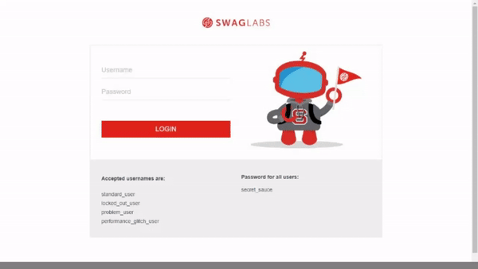

<h1 align="center">
   Desafio Automção de Testes da NextQA
</h1>

 

## 💻 Desafio

O desafio consiste em automatizar os cenários descritos abaixo da aplicação https://www.saucedemo.com/ 

Cenários:
1. Login com sucesso
2. Login com senha inválida
3. Efetuar a compra de um produto e validar a mensagem: "THANK YOU FOR YOUR ORDER"

## ⚙ Configuração

1- Para instalar as dependências:
> 
2- Para iniciar a aplicação:
> 

## :camera: Demonstração

  

## :rocket: Tecnologias

Esse projeto foi desenvolvido com as seguintes tecnologias:

✔️HTML

✔️Typescript

---
