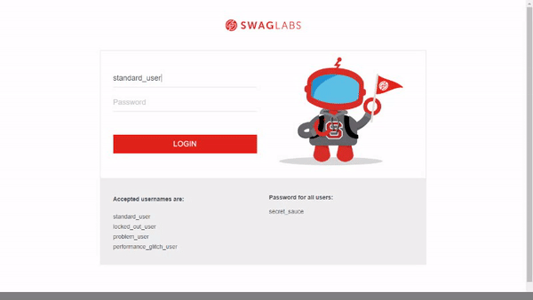
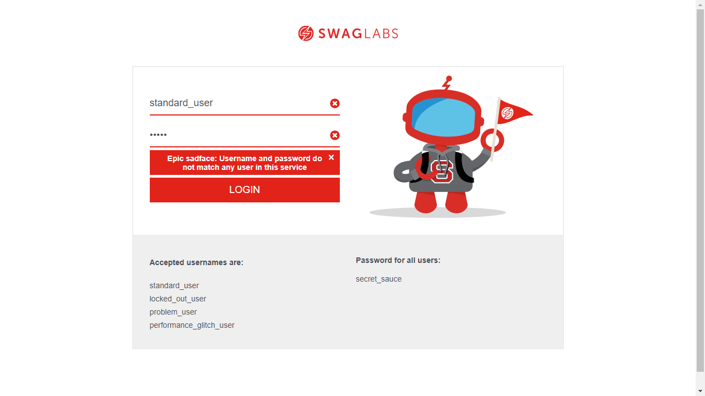

<h1 align="center">
   Desafio Automação de Testes da NextQA
</h1>
 
## 💻 Desafio
O desafio consiste em automatizar os cenários descritos abaixo da aplicação https://www.saucedemo.com/ 
Cenários:
1. Login com sucesso
2. Login com senha inválida
3. Efetuar a compra de um produto e validar a mensagem: "THANK YOU FOR YOUR ORDER"
## :camera: Demonstração

  1. Login com sucesso
    
  

 

  2. Login com senha inválida
    
  

    
   3. Efetuar a compra de um produto e validar a mensagem: "THANK YOU FOR YOUR ORDER"
  
  

## ⚙ Configuração
1- Para instalar as dependências:
> 
2- Para iniciar a aplicação:
> 
## :rocket: Tecnologias
Esse projeto foi desenvolvido com as seguintes tecnologias:
✔️HTML
✔️Typescript
---
